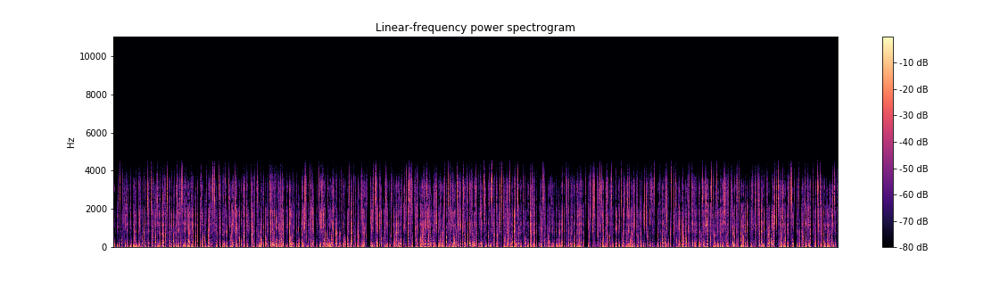

###### Pre-word: 3.1-4.1 and the associated function modules are not complete. They are merely included to show the entirety of my work process. They will continue to be updated from this point.

## Overview:

The purpose of this projects was to explore the nuances behind building programs that can "listen". Examples of such software include Siri, Alexa, and Google Assistant.

This chapter will be a current / post view of the project and everything from "Problem: " down will be the initial development and outlining of the project. Since this is for a project this chapter will be saved as is at the bottom of the page after any improvements are made to the models in the future. 

The initial goal was to develop a series of ML models that would be able to identify a spoken language, transcribe it into text, and translate it into a different language. My initial plan was to build 3 models (More for alternative languages) that would handle these steps in series. I later realized I would need 4 since speech-to-text on a character by character basis is not extremely accurate a model for guessing the correct words would be needed to ensure accurate transcription.

#### Phase 1:

The first phase of these problems was handled successfully. Although, I would change my methodology a little. The documentation I found and the models I based my modeling procedure off of used librosa spectrograms in order to convert and save the model as an image. The approach I took for my second modeling phase (transcription) skipped this step altogether by building a custom generator function. This method turns out be much more efficient. 

The model was based on reading in 15 second increments of speech and converting it into a spectrogram (A colorized representation of frequencies pre timestamp)  Using Data from https://nats.gitlab.io/swc/ These images were saved and then loaded using ImageDataGenerator (A Tensorflow tool for processing image data).

The model was fed using this generator and performed multiple layers of convolution across the images. The data was then fed into several fully connected layers with a sigmoid output. This output returned 1 if the file was in English and 0 if it was in German. The model could be retrained using transfer learning with a softmax output to predict for multiple languages.

#### Phase 2:

There were many shortcomings during this project. There is not a wealth of information available for speech to text models online. There are many github repositories that use varying modeling frameworks (pytorch, tensorflow, etc..) but they all handle very specific types of data and have very specific dependency requirements. Due to the lack of working (and easy to read/understand) Speech-to-Text models I attempted to build my own. 

The Data I used for this step is located here http://www.openslr.org/12/

The most relevant information I was able to find was pulled directly from Keras' tutorial pages. I was able to find an easy to understand framework for text to text translation. (This is not the same as speech-to-text transcription but the model was useful in building a framework) https://keras.io/examples/lstm_seq2seq/  This model uses an encoder-decoder framework which means it takes the input and creates model states which get passed to the decoder model to translate. 

Due to my initial data being a soundfile and my target data being text my encoder inputs and decoder outputs had very different expected results. My first hunch was to create a stack of inputs (since the model would expect the same size every time I had to pad the soundfiles with empty data (0's) to make them the same size. And since my outputs were of different lengths I created a generator that stacked them to the same length.

The model would peak around 40% accuracy. Which is reasonably high given there are 30 choices for characters at each step. However, my assumption is the model was unable to fit to the data since any "t" step woulf like any other. So if it was trying to predict the word "The" vs "Tree" it would try the same one each time. 

#### Future Phase 2 plans:

My next step in attempting to solve this is to have the generator create sliding windows based on expected file length. I can foresee some issues this though. For predicting data the file length would not be predetermined so we need a fixed window length. If predictions are being done one character by one character this could mean we may have too many or not enough windows to create the expected text. Aiming on the too long side we could have the model built to stop after a finish character is made. But then it could stop before the file is done reading.

Ultimately, I would like to build a corpus of word vectors (NDimensional representation of a word) because it is more efficent memory-(and context)-wise than a one-hot encoded dictionary of every word. I would want my data generator to split the data based off of lulls or silences between words and then feed these segments into a model for predicting which word is spoken. This would allow me to use encoder decoder to pass states as well segmented inputs. Another model might be needed in order to correctly identify split points on the sound data and the data to train it would need to be hand crafted.

#### Phase 3:

Has yet to begin...

Will likely use the same model I used for the initial attempts on phase 2.

#### Things learned thusfar:

I've learned a lot of intersting things about modeling. One interesting thing is that you can build multiple models and train them from the same DAG (Directed Acyciclic Graph). The DAG is the input to output set for structuring a model in Tensorflow. Following the Keras example I linked above the encoder model is trained and then re-written with different inputs utilizing the weights from training with first iteration. 

Speech to text models take a long time to train. When I created my loop for training one epoch (loop through all the samples) was estimated to take just under 45 days on my local machine. I stopped it early since the the performance gained peaked after ~2 hours and didn't improve overnight. 

Some problems are definitely made for cloud computing and I'm beginning to feel that NLP projects are typically amongst them. 

I've learned that building custom generator and training functions (while tedious and time consuming) makes it much easier to debug and makes things run in a much more efficient manner.

The EDA for speech problems isn't quite as much as it is for Tabular Data problems but, the Data Cleaning and Transformation is exponentially more time consuming. 

# The Project:

## Problem:

#### First Question:
1. Can a Neural Network model accurately detect languages being spoken? 
(*Trick Question*) I know they can. But I'm going to attempt to do it from a relative baseline.
I will be using others models as inspiration but for purposes of experimentation I will be training on data I found on-line and building the model "from scratch" using TensorFlow and Keras frameworks. 

The goal will be to make the models work as quickly as possible since, in practice, I would want this operation to occur in a similar manner to 'wake words' for virtual assistants such as Siri, Google, and Alexa.

###### If I like the answer to my first question:

2. Can a Neural Network detect spoken words and transcribe them accurately?
(*Again Trick Question*) 
This model can be a little more robust since it will have a more complicated task. But ideally I would like it generate a live script of spoken words in a relatively quick manner with as little lag as possible.

3. Can a Neural Network translate from one language to another?
(*Guess what kind of question this is*)
This model is likely to be the fastest since it will be handling all text data which (should be) a little smaller than audio files and also contain more discrete features. 

- Bonus: Convert speech to text:

## Goals:

1. The first goal is to complete the first question with relatively high accuracy and develop a STRONG understanding of neural network assembling, hyper-parameters, and architecture.
2. Complete all of my questions.
3. Complete my bonus.
4. Find insights into ways current leading models are actually handling data (under the hood)
5. Generate insight into new ways neural networks can be built in order to handle audio data.
6. Publish and open-source a powerful model for handling all or any of theses tasks.

## Data:

Current Data was pulled from:
https://nats.gitlab.io/swc/

Data will be processed in using soundfile and librosa libraries I found by exploring Github- 

I will make several columns in my df:

- A label of language (to be used as label column)
- The array generated by soundfile (to be used feature array)
- A label for which recording the data file was generated from and which order it occured in the sequence. (To make error tracing simpler)

## Modeling:

Modeling will be done with Neural Networks. More research will be conducted on current Architecture for Audio processing models.

An initial model will be generated to detect language. I would like this model to be as shallow and narrow as possible so that in deployment it would be able to identify languages quickly. And allow all or most working data to be stored in L1 or L2 cache.

The model will make use of convolutions to help isolate features regardless of positioning in data. A semi-wide feed to Fully connected is going to be used to allow for many features to be detected and used in predicting.

This model is the base goal for my project.

## Additional Models:

The next step would be to use RNN's with LTSM to convert live speech to text. I will initally only be doing this with English Data since I can verify accuracy by ear and sight quickly.

Transfer learning would then be used (with minimal replacement) to train a model to recognize German Data that was located online.

If a promising result can be obtain from this I will then pull from various Translation DataSets I found online. I will send Snippets of the data to some German Grad students I've met online to assist in verifying whether the translations are reasonably accurate and capture nuanced differences in the language.

A third (fourth) model will then be built (and transfer learned) to translate the data. (Using as large of a Syntax flow (Sentence vs. Paragraph) as possible)

## Next Steps (Project Mapping):

Chopping Data and mapping features to labels by using pandas.

## Expectations:
Modeling will probably take the majority of the time for this project. And the later steps will likely have to be completed after graduation.

Given limited resources (financially) to big data solutions I imagine I will run into road blocks while training the later models.

Given the expected (relatively) shallow nature of my preliminary model I suspect my local GPU should handle it well.

## External Libraries:

1. Librosa:
https://librosa.github.io/librosa/

Librosa markets themselves as an open-source library for audio and music analysis:
I have found a python open-source package named librosa on github. The built in visualizer is pretty nifty although not being necessary for the scope of the project. The main benefit I see with this data is that it returns my audio file as a numpy array. This will make it substantially easier to feed my model.

2. TensorFlow/ Keras
https://www.tensorflow.org/guide/keras

TensorFlow is a Neural Network model and Keras is a high level API built into TensorFlow (Previously seperate and built on top of) Keras with TensorFlow offers python users a novel and convenient way to generate Neural Network Architectures and even includes libraries for saving them as well.

3. The Spoken Wikipedia Corpora:
https://nats.gitlab.io/swc/

This was really a stroke of luck. The dataset are quite large for the tasks I am attempting to perform. The Spoken Wikipedia Corpora offers many audio recordings in three different languages but, they also offer something called 'Aligned Text Files'. I'm still exploring what exactly these are but they sound like they will be a great assistance in my modeling process!
