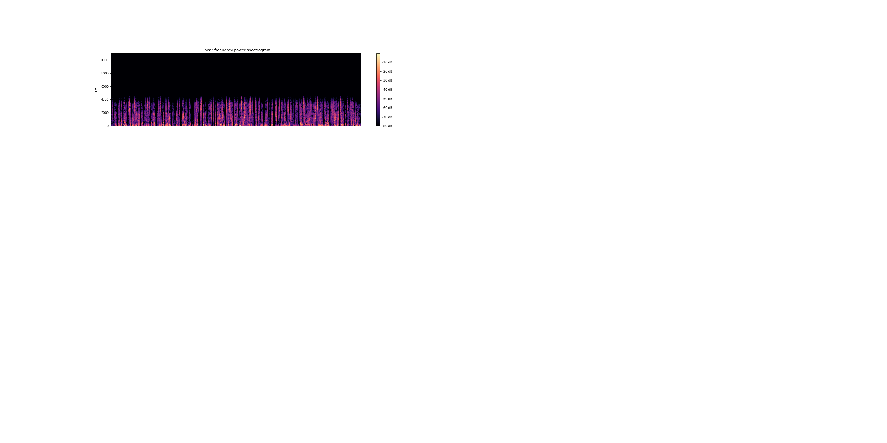

## Problem:

#### First Question:
1. Can a Neural Network model accurately detect languages being spoken? 
(*Trick Question*) I know they can. But I'm going to attempt to do it from a relative baseline.
I will be using others models as inspiration but for purposes of experimentation I will be training on data I found on-line and building the model "from scratch" using TensorFlow and Keras frameworks. 

The goal will be to make the models work as quickly as possible since, in practice, I would want this operation to occur in a similar manner to 'wake words' for virtual assistants such as Siri, Google, and Alexa.

###### If I like the answer to my first question:

2. Can a Neural Network detect spoken words and transcribe them accurately?
(*Again Trick Question*) 
This model can be a little more robust since it will have a more complicated task. But ideally I would like it generate a live script of spoken words in a relatively quick manner with as little lag as possible.

3. Can a Neural Network translate from one language to another?
(*Guess what kind of question this is*)
This model is likely to be the fastest since it will be handling all text data which (should be) a little smaller than audio files and also contain more discrete features. 

- Bonus: Convert speech to text:

## Goals:

1. The first goal is to complete the first question with relatively high accuracy and develop a STRONG understanding of neural network assembling, hyper-parameters, and architecture.
2. Complete all of my questions.
3. Complete my bonus.
4. Find insights into ways current leading models are actually handling data (under the hood)
5. Generate insight into new ways neural networks can be built in order to handle audio data.
6. Publish and open-source a powerful model for handling all or any of theses tasks.

## Data:

Current Data was pulled from:
https://nats.gitlab.io/swc/

Data will be processed in using soundfile and librosa libraries I found by exploring Github- 

I will make several columns in my df:

- A label of language (to be used as label column)
- The array generated by soundfile (to be used feature array)
- A label for which recording the data file was generated from and which order it occured in the sequence. (To make error tracing simpler)

## Modeling:

Modeling will be done with Neural Networks. More research will be conducted on current Architecture for Audio processing models.

An initial model will be generated to detect language. I would like this model to be as shallow and narrow as possible so that in deployment it would be able to identify languages quickly. And allow all or most working data to be stored in L1 or L2 cache.

The model will make use of convolutions to help isolate features regardless of positioning in data. A semi-wide feed to Fully connected is going to be used to allow for many features to be detected and used in predicting.

This model is the base goal for my project.

## Additional Models:

The next step would be to use RNN's with LTSM to convert live speech to text. I will initally only be doing this with English Data since I can verify accuracy by ear and sight quickly.

Transfer learning would then be used (with minimal replacement) to train a model to recognize German Data that was located online.

If a promising result can be obtain from this I will then pull from various Translation DataSets I found online. I will send Snippets of the data to some German Grad students I've met online to assist in verifying whether the translations are reasonably accurate and capture nuanced differences in the language.

A third (fourth) model will then be built (and transfer learned) to translate the data. (Using as large of a Syntax flow (Sentence vs. Paragraph) as possible)

## Next Steps (Project Mapping):

Chopping Data and mapping features to labels by using pandas.

## Expectations:
Modeling will probably take the majority of the time for this project. And the later steps will likely have to be completed after graduation.

Given limited resources (financially) to big data solutions I imagine I will run into road blocks while training the later models.

Given the expected (relatively) shallow nature of my preliminary model I suspect my local GPU should handle it well.

## External Libraries:

1. Librosa:
https://librosa.github.io/librosa/

Librosa markets themselves as an open-source library for audio and music analysis:
I have found a python open-source package named librosa on github. The built in visualizer is pretty nifty although not being necessary for the scope of the project. The main benefit I see with this data is that it returns my audio file as a numpy array. This will make it substantially easier to feed my model.

2. TensorFlow/ Keras
https://www.tensorflow.org/guide/keras

TensorFlow is a Neural Network model and Keras is a high level API built into TensorFlow (Previously seperate and built on top of) Keras with TensorFlow offers python users a novel and convenient way to generate Neural Network Architectures and even includes libraries for saving them as well.

3. The Spoken Wikipedia Corpora:
https://nats.gitlab.io/swc/

This was really a stroke of luck. The dataset are quite large for the tasks I am attempting to perform. The Spoken Wikipedia Corpora offers many audio recordings in three different languages but, they also offer something called 'Aligned Text Files'. I'm still exploring what exactly these are but they sound like they will be a great assistance in my modeling process!